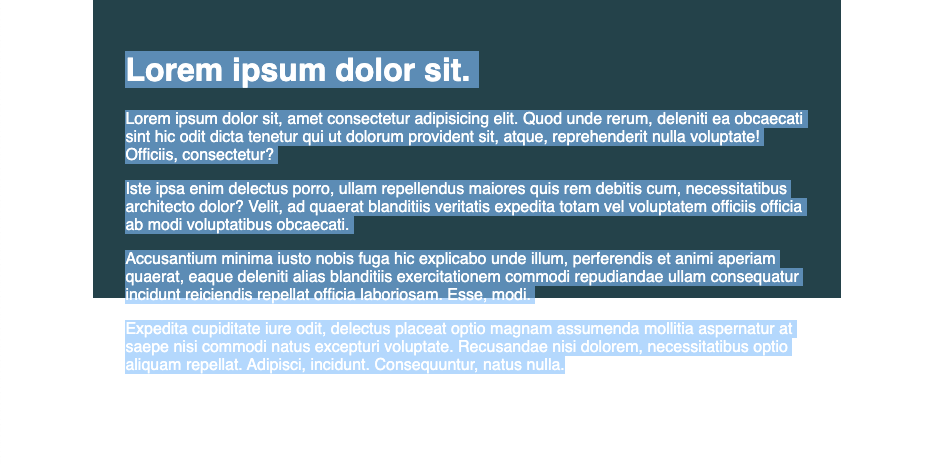
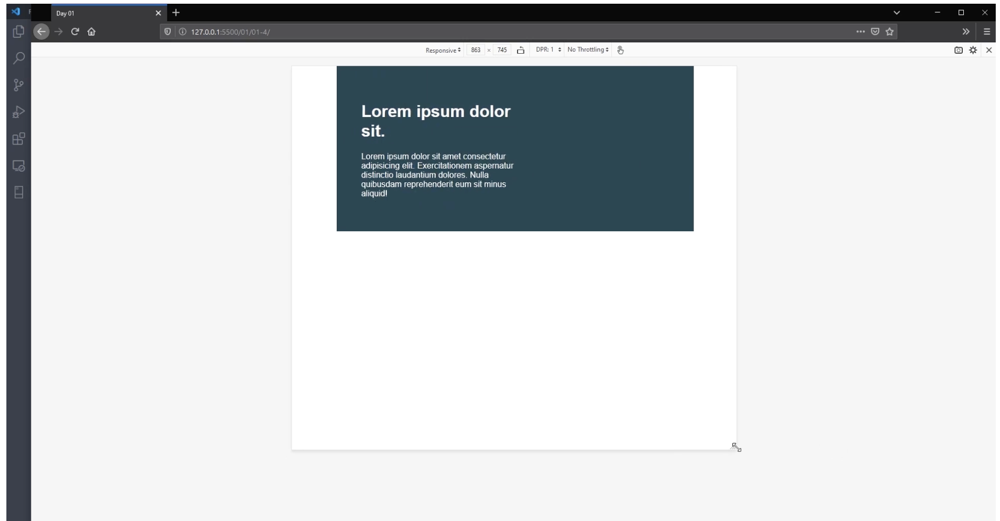

# kevinpowell-conquering-responsive-layouts-21-day-course
 This is my code along with Kevin Powell's free responsive CSS course.

## How this repo is structured

Instead of 21 different repos, I've decided to create folders for each day in the main branch. I hope this will keep things a bit more organized.

An ancillary goal is to improve how I document my project's progress.

### Overview of course:
- Day 1: Using Percentages vs. Fixed widths
  - Summary / Recap:
    - Websites are responsive by nature, and if it's not, we need to look at whate we did to break that responsiveness
    - Don't set container heights / or child widths unless you have to.
    - Don't use fixed measurement values for responsive design.
  - Challenge Starting Point: 
  - Challenge Expected Endpoint: 
  - My solution: 